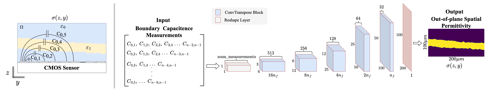

# 🧪 <span>&#181;</span>ECT

Microscale 3-D Capacitence Tomography with a CMOS Sensor Array. 

## Overview



## Citation

```
@article{abdelatty2023microscale,
  title={Microscale 3-D Capacitence Tomography with a CMOS Sensor Array},
  author={Abdelatty, Manar and Incandela, Joseph and Hu, Kangping and Larkin, Joseph W. and Reda, Sherief and Rosenstein, Jacob},
  conference={IEEE Biomedical Circuits and Systems Conference (BioCAS)},
  year={2023},
  publisher={IEEE}
}
```

## License 
BSD 3-Clause License. See [LICENSE](LICENSE). 
